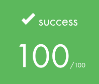
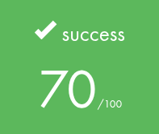
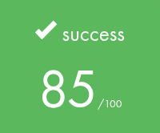
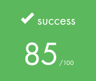
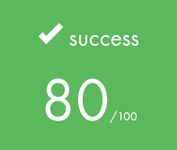
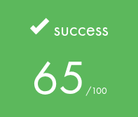
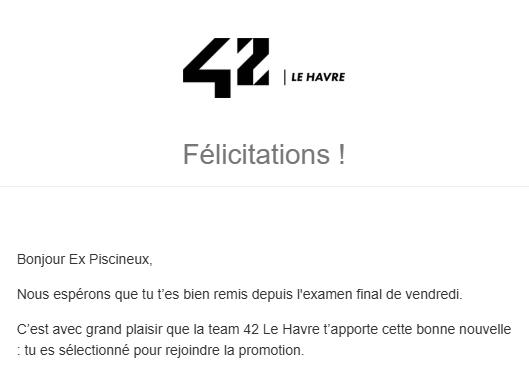

# 🚀 Piscine 42 - Cadinot Zibrian 🌊

Bienvenue sur mon dépôt dédié à la **piscine de l'école 42** !  
Ici, je partage tous mes projets, exercices et avancées de cette expérience intense et formatrice.

---

## 📚 À propos de la piscine 42

La piscine 42 est une immersion de **4 semaines** qui teste nos capacités d’apprentissage, d’adaptation, et surtout de travail en équipe.  
Un véritable challenge technique, physique et mental pour repousser ses limites ! 💪

---

## 📂 Contenu du dépôt

- 📁 **ex00, ex01, ...** : dossiers des exercices de la piscine  

---

## 🎯 Objectifs personnels

- ⚡ **Approfondir mes bases en C** pour maîtriser pleinement ce langage  
- 🧠 **Renforcer ma logique algorithmique** et ma résolution de problèmes  
- 🤝 **Développer mes compétences** en travail collaboratif et gestion de projet  
- 🔥 **Améliorer ma rigueur, persévérance et gestion du stress**

---
## Mon avancer

| Cellule  | Statut   | Résultat |
|----------|----------|----------|
| [🐚 Shell00](Shell00) | ✅ Fini  |  |
| [🐚 Shell01](Shell01) | ✅ Fini  |  |
| [📦 C00](C00)     | ✅ Fini  |  |
| [📦 C01](C01)     | ✅ Fini  |  |
| [📦 C02](C02)     | ✅ Fini  |  |
| [📦 C03](C03)     | ✅ Fini  |  |
| [📦 C04](C04)     | ✅ Fini  |  |
| [📦 C05](C05)     | ✅ Fini  |  |
| [📦 C06](C06)     | ✅ Fini  |  |
| [📦 C07](C07)     | ✅ Fini  |  |
| [📦 C08](C08)     | ✅ Fini  |  |
| [📦 C09](C09)     | ✅ Fini  |  |
| [📦 C10](C10)     | ❌ En pause  | 💤 Flemmardise (Hexdump manquant 😅) |
| [📦 C11](C11)     | ✅ Fini  |  |

--

# J’ai réussi, grâce à tout cela, à être admis 🎉

---

### 📊 Nombre de lignes de code

- #### 5484 ligne

---
